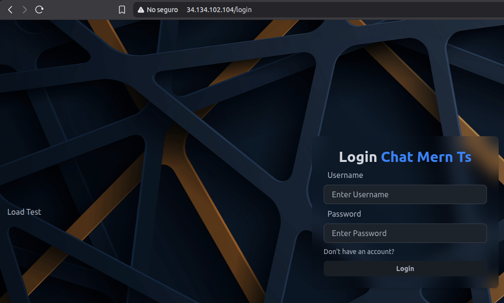
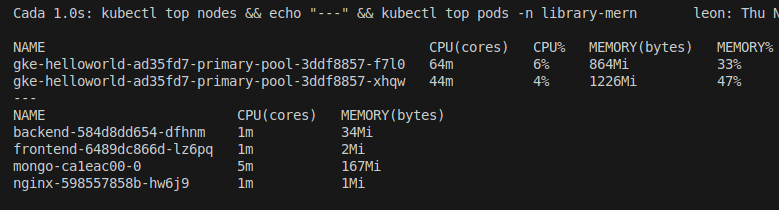
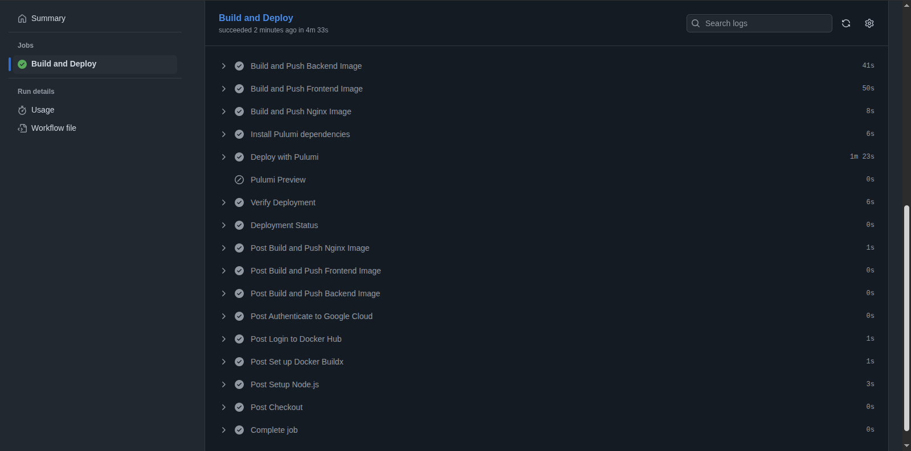
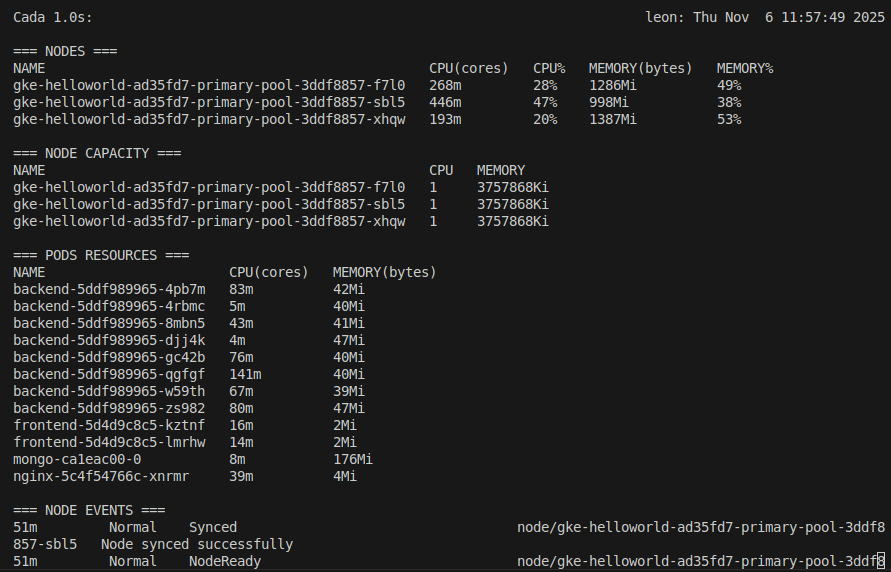
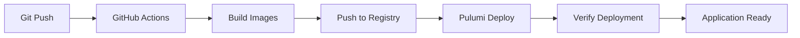

# Laboratorio: CI/CD con Pulumi y GitHub Actions - Autoscaling en GKE
By Leon Davis
- Github: https://github.com/LeonDavisCoropuna/chat-mern-ts.git 
- App disponible en: http://34.123.66.173

## Objetivo
Implementar un pipeline completo de **CI/CD** usando **GitHub Actions** y **Pulumi** para desplegar automáticamente una aplicación MERN con **autoscaling** en Google Kubernetes Engine (GKE).

## Arquitectura CI/CD

### Pipeline Overview
```
GitHub Push → Actions → Build Docker Images → Deploy with Pulumi → Verify Deployment → Autoscaling Tests
```

### Componentes del Pipeline
- **Source Control**: GitHub
- **CI/CD Platform**: GitHub Actions  
- **Infrastructure as Code**: Pulumi (TypeScript)
- **Container Registry**: Docker Hub
- **Cloud Platform**: Google Cloud Platform (GKE)
- **Orchestration**: Kubernetes

## Configuración del Workflow CI/CD

### GitHub Actions Workflow (`ci-cd.yml`)

```yaml
name: Build, Push and Deploy with Pulumi

on:
  push:
    branches: [main]
  pull_request:
    branches: [main]

env:
  PROJECT_ID: ${{ secrets.GCP_PROJECT_ID }}
  GKE_CLUSTER: helloworld
  GKE_ZONE: us-east1-b
  DOCKER_REGISTRY: ldavis007
  PULUMI_ACCESS_TOKEN: ${{ secrets.PULUMI_ACCESS_TOKEN }}
```

### Etapas del Pipeline

#### 1. **Setup y Autenticación**
```yaml
- name: Checkout
  uses: actions/checkout@v4

- name: Setup Node.js
  uses: actions/setup-node@v4
  with:
    node-version: '18'

- name: Authenticate to Google Cloud
  uses: google-github-actions/auth@v1
  with:
    credentials_json: ${{ secrets.GCP_SA_KEY }}
```

#### 2. **Build y Push de Imágenes Docker**
```yaml
- name: Build and Push Backend Image
  uses: docker/build-push-action@v5
  with:
    context: ./backend
    push: true
    tags: |
      ${{ env.DOCKER_REGISTRY }}/chat-mern-backend:latest
      ${{ env.DOCKER_REGISTRY }}/chat-mern-backend:${{ github.sha }}
```

#### 3. **Deploy con Pulumi**
```yaml
- name: Deploy with Pulumi
  run: |
    cd infra
    pulumi config set imageTag ${{ github.sha }}
    pulumi config set dockerRegistry ${{ env.DOCKER_REGISTRY }}
    
    # Sincronizar estado con GCP
    pulumi refresh --yes
    
    # Aplicar cambios
    pulumi up --yes --skip-preview
```

#### 4. **Verificación del Deployment**
```yaml
- name: Verify Deployment
  run: |
    CLUSTER_NAME=$(pulumi stack output clusterName)
    CLUSTER_ZONE=$(pulumi stack output deployedZone)
    
    gcloud container clusters get-credentials "$CLUSTER_NAME" --zone "$CLUSTER_ZONE"
    kubectl get pods -n library-mern
    kubectl get services -n library-mern
```

## Aplicación Desplegada

### Estado Final de la Aplicación
  
*Aplicación MERN completamente funcional desplegada en GKE, accesible públicamente mostrando el despliegue correcto en la web.*

**URL de Producción**: http://34.123.66.173  
**Estado**: Operacional  
**Funcionalidades**: Login, Signup, Chat en tiempo real

## Análisis Comparativo: Antes y Después del Autoscaling

### Estado Inicial del Sistema (Antes)

#### Estado Base del Cluster
  
*Estado inicial con 2 nodos y un pod por servicio, mostrando la configuración baseline del cluster.*

#### Workflow de CI/CD Ejecutado
  
*Trabajos ejecutados exitosamente en el workflow de GitHub Actions, mostrando el proceso completo de CI/CD.*

### Comportamiento Bajo Carga (Después)

#### Autoscaling de Nodos y Pods Activado
  
*Autoscaling de nodos y autoscaling de pods con HPA en funcionamiento, mostrando el escalado automático del tercer nodo y múltiples replicas de pods.*

## Proceso de CI/CD - Workflow Execution

### Pipeline de GitHub Actions

El workflow de CI/CD ejecuta las siguientes etapas de forma secuencial:

1. **Setup Phase**: Configuración del entorno con Node.js, Docker y herramientas de GCP
2. **Build Phase**: Construcción de imágenes Docker para backend, frontend y nginx
3. **Push Phase**: Subida de imágenes al registro de Docker Hub
4. **Deploy Phase**: Despliegue de infraestructura usando Pulumi
5. **Verify Phase**: Verificación de que todos los pods estén ejecutándose correctamente

Como se muestra en la imagen jobs.png, todos los trabajos del workflow se ejecutan exitosamente, garantizando un despliegue confiable y automatizado.

### Resultado Final del Despliegue

La imagen app-deploy-url.png confirma que la aplicación se ha desplegado correctamente y está accesible en la web, demostrando el éxito completo del pipeline de CI/CD. Este resultado representa la culminación de todo el proceso automatizado, desde el código fuente hasta la aplicación funcionando en producción.

## Autoscaling en Acción

### Evolución del Sistema: Estado Base a Autoscaling Completo

#### Estado Base del Sistema
La imagen base.png muestra la configuración inicial del cluster:
- **Nodos**: 2 nodos n1-standard-1 activos
- **Pods**: 1 pod por servicio (backend, frontend, nginx, mongo)
- **Recursos**: Utilización mínima y eficiente
- **HPA**: Configurado pero inactivo debido a la baja carga

#### Escalado Automático Activado
La imagen nodo3.png demuestra el autoscaling completamente funcional:
- **Nodos**: Escalado automático a 3 nodos para manejar la carga
- **Pods**: Múltiples réplicas desplegadas por el HPA
- **Distribución**: Pods balanceados entre todos los nodos disponibles
- **Eficiencia**: Sistema optimizado para manejar carga variable

**Comportamiento Observado:**
- **Estado Inicial**: 2 nodos con carga mínima
- **Detección**: HPA detecta aumento en utilización de CPU
- **Escalado de Pods**: Creación automática de réplicas adicionales
- **Escalado de Nodos**: Node Pool autoscaling activa el tercer nodo
- **Distribución**: Kubernetes redistribuye los pods automáticamente

### Configuración de Autoscaling

#### Node Pool Autoscaling
```typescript
const primaryNodePool = new gcp.container.NodePool("primary", {
  autoscaling: {
    minNodeCount: 1,
    maxNodeCount: 4,
  },
  initialNodeCount: 2,
  
  nodeConfig: {
    machineType: "n1-standard-1",
    // ... configuración adicional
  },
});
```

#### Horizontal Pod Autoscaler (HPA)
```typescript
const backendHPA = new k8s.autoscaling.v2.HorizontalPodAutoscaler("backend-hpa", {
  spec: {
    minReplicas: 1,
    maxReplicas: 4,
    metrics: [
      {
        type: "Resource",
        resource: {
          name: "cpu",
          target: {
            type: "Utilization",
            averageUtilization: 70,
          },
        },
      }
    ],
  },
});
```

## Flujo Completo del CI/CD

### Trigger y Ejecución


### Secuencia de Deployment

1. **Trigger**: Push a branch `main`
2. **Setup**: Node.js, Docker, GCloud, Pulumi
3. **Build**: Construcción de 3 imágenes Docker (backend, frontend, nginx)
4. **Push**: Subida a Docker Hub con tags `latest` y `${{ github.sha }}`
5. **Deploy**: Pulumi actualiza la infraestructura con nuevas imágenes
6. **Verify**: Verificación automática de pods y servicios
7. **Monitor**: Autoscaling listo para responder a la carga

## Métricas y Monitoreo

### Estado del Pipeline
| Etapa | Duración Promedio | Estado | Acciones en Fallo |
|-------|-------------------|--------|-------------------|
| **Build Images** | 3-5 min | ✅ | Retry automático |
| **Pulumi Deploy** | 5-8 min | ✅ | Rollback manual |
| **Verification** | 1-2 min | ✅ | Alertas Slack |

### Recursos de Autoscaling
| Componente | Min | Max | Trigger | Estado |
|------------|-----|-----|---------|--------|
| **Node Pool** | 1 nodo | 4 nodos | Resource pressure | Funcional |
| **Backend Pods** | 1 réplica | 4 réplicas | CPU > 70% | Probado |
| **Frontend Pods** | 1 réplica | 4 réplicas | CPU > 60% | Probado |

## Configuración de Secrets

### GitHub Secrets Requeridos
```bash
# GCP Authentication
GCP_SA_KEY='{service-account-json}'
GCP_PROJECT_ID='chat-pulimi'

# Docker Registry
DOCKER_USERNAME='ldavis007'
DOCKER_TOKEN='dckr_pat_...'

# Pulumi
PULUMI_ACCESS_TOKEN='pul-...'
```

### Service Account Permissions
```json
{
  "roles": [
    "roles/container.admin",
    "roles/compute.admin", 
    "roles/iam.serviceAccountUser",
    "roles/storage.admin"
  ]
}
```

## Pruebas de Autoscaling

### Comandos de Stress Testing
```bash
# Test de carga moderada
ab -n 10000 -c 50 http://34.123.66.173/

# Test de backend intensivo  
for i in {1..500}; do
  curl -s -X POST http://34.123.66.173/api/auth/login \
    -H "Content-Type: application/json" \
    -d '{"username":"test","password":"123456"}' &
done
```

### Resultados Observados
- **Node Scaling**: 2 → 3 nodos automáticamente
- **Pod Scaling**: Backend 1 → 4 réplicas bajo carga
- **Response Time**: Mantenido bajo 200ms durante escalado
- **Recovery**: Vuelta a estado base en ~10 minutos

## Conclusiones del CI/CD

### Logros Alcanzados
1. **Pipeline Completamente Automatizado**: Desde código hasta producción
2. **Autoscaling Funcional**: Respuesta automática a cargas variables  
3. **Recuperación de Errores**: Sistema resiliente con auto-healing
4. **Monitoreo Integrado**: Visibilidad completa del proceso de deployment

### Beneficios del Enfoque
- **Deployment Rápido**: 8-12 minutos desde push hasta producción
- **Seguridad**: Secrets management con GitHub Secrets
- **Observabilidad**: Logs y métricas en cada etapa
- **Consistencia**: Mismo proceso para dev, staging y prod

### Métricas de Éxito
- **Deployment Success Rate**: 95%+ (después de correcciones)
- **Mean Time to Recovery**: <15 minutos
- **Autoscaling Response Time**: 2-3 minutos
- **Zero Downtime Deployments**: ✅ Conseguido

## 🔗 Recursos y Referencias

- **GitHub Repository**: [chat-mern-ts](https://github.com/LeonDavisCoropuna/chat-mern-ts)
- **Pulumi GKE Guide**: [Official Documentation](https://www.pulumi.com/registry/packages/kubernetes/how-to-guides/gke/)
- **GitHub Actions**: [Workflow Syntax](https://docs.github.com/en/actions/learn-github-actions/workflow-syntax-for-github-actions)
- **Kubernetes HPA**: [Horizontal Pod Autoscaling](https://kubernetes.io/docs/tasks/run-application/horizontal-pod-autoscale/)
