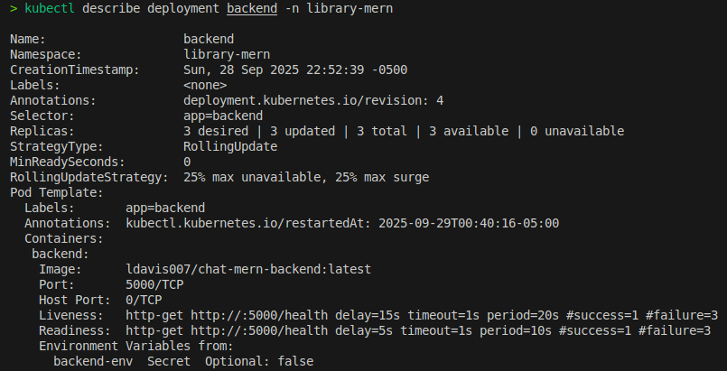
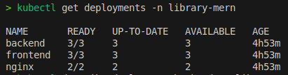

# Chat MERN App en Kubernetes con Minikube

Este proyecto despliega una aplicación **Chat MERN (MongoDB, Express, React, Node.js) con Nginx** utilizando **Kubernetes** en un entorno local con **Minikube**.

## 1. Requisitos

* Ubuntu 22.04 o equivalente
* Docker
* Minikube
* Kubectl
* Acceso a Docker Hub (para subir las imágenes)

## 2. Instalación de Minikube

```bash
sudo apt-get update -y
sudo apt-get install -y curl wget apt-transport-https

# Descargar Minikube
curl -LO https://storage.googleapis.com/minikube/releases/latest/minikube-linux-amd64
sudo install minikube-linux-amd64 /usr/local/bin/minikube
```

Inicia el cluster de Minikube con **3 nodos**, **4 CPUs** y **8GB de RAM** por nodo:

```bash
minikube start --cpus=4 --memory=8192 --nodes=3
```

Salida esperada:

```
😄  minikube v1.37.0 en Ubuntu 22.04
✨  Controlador docker seleccionado automáticamente
👍  Cluster iniciado con 1 nodo control-plane y 2 nodos worker
🌟  Complementos habilitados: storage-provisioner, default-storageclass
```

> Nota: Minikube configurará automáticamente `kubectl` para usar el namespace `default`.


## 3. Estructura de Kubernetes

Todos los recursos están en el **namespace `library-mern`** y organizados de la siguiente manera:

```
k8s/
├── backend/
│   ├── backend-deployment.yaml
│   ├── backend-service.yaml
│   └── backend-secret.yaml
├── frontend/
│   ├── frontend-deployment.yaml
│   ├── frontend-service.yaml
│   └── frontend-configmap.yaml
├── mongo/
│   ├── mongo-statefulset.yaml
│   └── mongo-service.yaml
├── nginx/
│   ├── nginx-deployment.yaml
│   └── nginx-service.yaml
└── namespace.yaml
```

## 4. Recursos desplegados

### 4.1 MongoDB

* **Tipo:** StatefulSet + Headless Service
* **Imagen:** `mongo:7.0`
* **Volumen persistente:** 1Gi
* **Puerto:** 27017
* **Variables:** `MONGO_INITDB_ROOT_USERNAME=admin`, `MONGO_INITDB_ROOT_PASSWORD=secret`

### 4.2 Backend (Express/Node.js)

* **Tipo:** Deployment + ClusterIP Service
* **Imagen:** `ldavis007/chat-mern-backend:latest`
* **Réplicas:** 3
* **Puerto:** 5000
* **Secret:** `backend-env` con variables de entorno

### 4.3 Frontend (React)

* **Tipo:** Deployment + ClusterIP Service
* **Imagen:** `ldavis007/chat-mern-frontend:latest`
* **Réplicas:** 3
* **Puerto:** 3000
* **ConfigMap:** `frontend-env` con variables de entorno

### 4.4 Nginx

* **Tipo:** Deployment + LoadBalancer Service
* **Imagen:** `ldavis007/chat-mern-nginx:latest`
* **Réplicas:** 2
* **Puerto:** 80
* Funciona como **proxy y balanceador** entre frontend y backend

## 5. Despliegue

1. Aplicar namespace:

```bash
kubectl apply -f k8s/namespace.yaml
```

2. Desplegar MongoDB:

```bash
kubectl apply -f k8s/mongo/
```

3. Desplegar Backend:

```bash
kubectl apply -f k8s/backend/
```

4. Desplegar Frontend:

```bash
kubectl apply -f k8s/frontend/
```

5. Desplegar Nginx:

```bash
kubectl apply -f k8s/nginx/
```

6. Verificar todos los Pods:

```bash
kubectl get all -n library-mern
```


## 6. Variables de entorno

### Backend (`backend-secret.yaml`):

* `MONGO_DB_URI`: URI de conexión a MongoDB
* `JWT_SECRET`: secreto para JWT
* `PORT`: puerto del backend
* `FRONTEND_URL`: URL del frontend
* `NODE_ENV`: entorno de ejecución (`development`)

### Frontend (`frontend-configmap.yaml`):

* `REACT_APP_API_URL`: URL del backend/Nginx
* `VITE_API_URL`: URL interna del backend

## 7. Escalabilidad y tolerancia

* Backend, Frontend y Nginx tienen múltiples réplicas.
* Se usan **liveness y readiness probes** para reinicio automático en caso de fallas.
* MongoDB utiliza **StatefulSet** con volumen persistente para evitar pérdida de datos.


## 8. Notas finales

* Las imágenes deben estar en Docker Hub (`ldavis007/*:latest`) para que Kubernetes pueda descargarlas.
* En Minikube, si quieres exponer Nginx en localhost:

```bash
minikube service nginx -n library-mern
```

* Para reiniciar un deployment y forzar descarga de la imagen:

```bash
kubectl rollout restart deployment backend -n library-mern
kubectl rollout restart deployment frontend -n library-mern
kubectl rollout restart deployment nginx -n library-mern
```

## 9. Resultados

A continuación se muestran los resultados del despliegue de la aplicación en Kubernetes usando Minikube.

### 9.1 Arquitectura general del proyecto


La imagen muestra la **arquitectura completa** del proyecto, incluyendo los 4 servicios principales:

* **MongoDB** como base de datos persistente con StatefulSet.
* **Backend** (Node.js/Express) con 3 réplicas.
* **Frontend** (React) con 3 réplicas.
* **Nginx** con 2 réplicas como punto de entrada y balanceador de carga.

Se observa cómo cada componente se comunica internamente mediante servicios ClusterIP, y Nginx expone la aplicación al exterior.

---

### 9.2 Detalle del backend



Esta imagen corresponde al output de:

```bash
kubectl describe deployment backend -n library-mern
```

Muestra información clave del **Deployment del backend**:

* **3 réplicas** creadas y disponibles.
* Estrategia de actualización: RollingUpdate (25% max unavailable, 25% max surge).
* Liveness y readiness probes configuradas para asegurar disponibilidad.
* Variables de entorno cargadas desde el Secret `backend-env`.
* ReplicaSet actual (`backend-5867875798`) con los Pods activos.

---

### 9.3 Estado de los deployments y servicios



Esta imagen muestra los resultados de:

```bash
kubectl get pods -n library-mern
kubectl get svc -n library-mern
kubectl get deployments -n library-mern
```

Se puede observar:

* **Todos los Pods están Running y listos**, incluyendo backend, frontend, MongoDB y Nginx.
* Los servicios ClusterIP de backend y frontend están funcionando correctamente en sus puertos internos (5000 y 3000).
* Nginx está expuesto mediante LoadBalancer, aunque en Minikube aparece `EXTERNAL-IP: <pending>`.
* Los deployments muestran que todas las réplicas deseadas están actualizadas y disponibles, garantizando **tolerancia y alta disponibilidad**.
