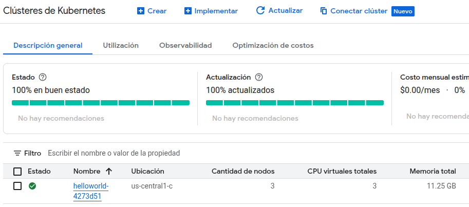
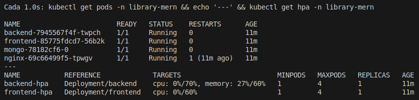
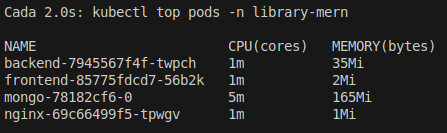
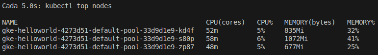
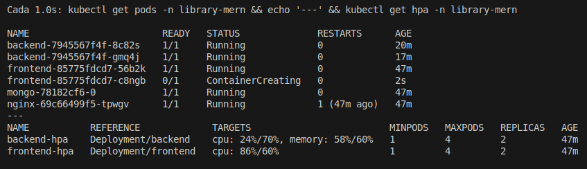
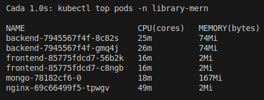
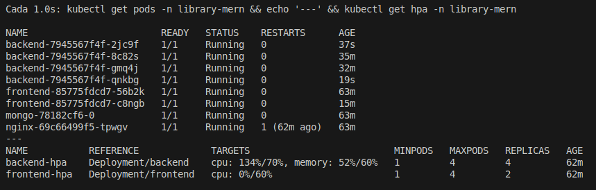
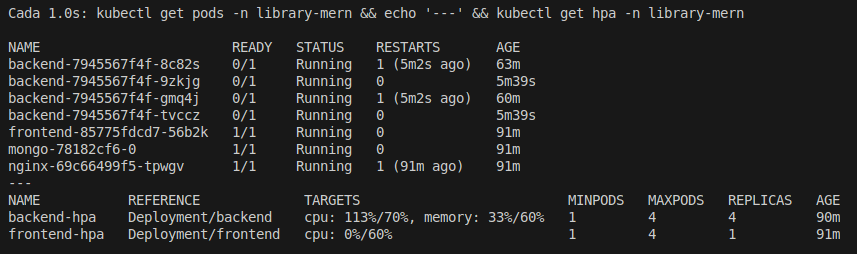
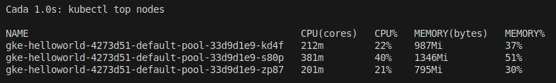

# Laboratorio: Pruebas de Autoscaling usando IaC con Pulumi
By Leon Davis
- Github: https://github.com/LeonDavisCoropuna/chat-mern-ts.git 
- App disponible en: http://34.123.66.173
## Objetivo
Configurar un escenario de **autoscaling** en Google Kubernetes Engine (GKE) usando **Pulumi** como herramienta OPEN SOURCE de Infrastructure as Code (IaC).

## Configuración Inicial

### Prerrequisitos
```bash
# Autenticación en GCP
mkdir -p infra && cd infra
gcloud auth login
gcloud config set project chat-pulumi
gcloud auth application-default login

# Instalación de Pulumi y dependencias
pulumi new typescript
npm install --save @pulumi/pulumi @pulumi/gcp @pulumi/kubernetes

# Configuración del proyecto
pulumi config set gcp:project chat-pulimi
pulumi config set gcp:zone us-central1-c
```

### Archivos de Configuración Generados

#### `Pulumi.yaml`
```yaml
name: chat-pulumi
description: Chat pulumi with autoscaling
runtime:
  name: nodejs
  options:
    packagemanager: npm
config:
  pulumi:tags:
    value:
      pulumi:template: typescript
```

#### `Pulumi.dev.yaml`
```yaml
config:
  gcp:project: chat-pulimi
  gcp:zone: us-central1-c
```

#### `kubeconfig.yaml` (generado automáticamente)
Configuración de acceso al cluster Kubernetes con autenticación GCP.


## Arquitectura Kubernetes MERN Implementada

### Diagrama de Arquitectura
```
Internet → NGINX (LoadBalancer:80) → Frontend (React) → Backend (API) → MongoDB
```

### Componentes Desplegados

#### 1. MongoDB (StatefulSet)
- **Namespace**: `mongodb`
- **Tipo**: StatefulSet con volumen persistente
- **Réplicas**: 1
- **Imagen**: `mongo:6.0`
- **Servicio**: Headless (`clusterIP: None`)
- **Almacenamiento**: 1Gi (ReadWriteOnce)
- **Seguridad**: Credenciales via Secret

#### 2. Backend API (Deployment + HPA)
- **Namespace**: `library-mern` 
- **Tipo**: Deployment con Horizontal Pod Autoscaler
- **Réplicas**: 1-4 (autoescalado)
- **Imagen**: `ldavis007/chat-mern-backend:latest`
- **Servicio**: ClusterIP (interno)
- **Autoscaling**: 
  - CPU: 70%
  - Memoria: 60%
  - Policies: +2 pods/60s (up), -1 pod/90s (down)

#### 3. Frontend React (Deployment + HPA)
- **Namespace**: `library-mern`
- **Tipo**: Deployment con Horizontal Pod Autoscaler
- **Réplicas**: 1-4 (autoescalado)
- **Imagen**: `ldavis007/chat-mern-frontend:latest`
- **Servicio**: ClusterIP (interno)
- **Autoscaling**:
  - CPU: 60%
  - Policies: +2 pods/60s (up), -1 pod/120s (down)

#### 4. NGINX Reverse Proxy (Deployment)
- **Namespace**: `library-mern`
- **Tipo**: Deployment
- **Réplicas**: 1
- **Imagen**: `ldavis007/chat-mern-nginx:latest`
- **Servicio**: LoadBalancer (punto de entrada público)
- **Funcionalidad**: Routing `/` → Frontend, `/api/` → Backend


## Especificaciones Técnicas Detalladas

### Recursos y Configuraciones

| Componente | Tipo | Réplicas | CPU | Memory | Servicio | Autoescalado |
|-------------|------|-----------|----------------------|-------------------------|-----------|---------------|
| **MongoDB** | StatefulSet | 1 | 150m / 300m | 256Mi / 512Mi | Headless | ❌ |
| **Backend** | Deployment | 1–4 | 100m / 150m | 128Mi / 200Mi | ClusterIP | ✅ (CPU 70%, Mem 60%) |
| **Frontend** | Deployment | 1–4 | 30m / 50m | 32Mi / 64Mi | ClusterIP | ✅ (CPU 60%) |
| **NGINX** | Deployment | 1 | 30m / 50m | 32Mi / 64Mi | LoadBalancer | ❌ |


### Configuración de Autoescalado

#### Backend HPA
```yaml
spec:
  minReplicas: 1
  maxReplicas: 4
  metrics:
  - type: Resource
    resource:
      name: cpu
      target:
        type: Utilization
        averageUtilization: 70
  - type: Resource
    resource:
      name: memory  
      target:
        type: Utilization
        averageUtilization: 60
```

#### Frontend HPA
```yaml
spec:
  minReplicas: 1
  maxReplicas: 4  
  metrics:
  - type: Resource
    resource:
      name: cpu
      target:
        type: Utilization
        averageUtilization: 60
```


## Comandos de Despliegue y Monitoreo

### Despliegue con Pulumi
```bash
# Desplegar infraestructura completa
pulumi up --yes

# Ver outputs (IPs, nombres)
pulumi stack output
```

### Monitoreo en Tiempo Real

```bash
# Ver estado del autoscaling
kubectl get hpa -n library-mern

# Monitorear recursos
kubectl top pods -n library-mern

# Ver logs de aplicación
kubectl logs -n library-mern deployment/backend -f
```

## Características de la Implementación

### Implementado con Pulumi (OPEN SOURCE)
- **Lenguaje**: TypeScript
- **Proveedor**: Google Cloud Platform (GKE)
- **Approach**: Infrastructure as Code declarativo

### Arquitectura de Microservicios
- **Segregación**: Namespaces separados para app y base de datos
- **Comunicación**: Servicios ClusterIP internos
- **Exposición**: Único punto de entrada via LoadBalancer

### Estrategias de Autoescalado
- **Horizontal Pod Autoscaling** (HPA) para backend y frontend
- **Métricas basadas en CPU y memoria**
- **Políticas de escalado configurables**
- **Anti-affinity** para distribución óptima de pods

## Pruebas de Autoscaling

### Metodología de Pruebas

Se realizaron pruebas exhaustivas del sistema de autoescalado bajo diferentes escenarios de carga, desde estado de reposo hasta carga extrema, para validar el comportamiento del Horizontal Pod Autoscaler (HPA) configurado en el clúster.

### Estado Inicial del Clúster

  
*Cluster GKE `helloworld-4273d51` desplegado en us-central1-c con 3 nodos y 3 CPUs virtuales.*

### Pruebas de Carga y Autoescalado

#### 1. Estado de Reposo (Baseline)

- **Pods y HPA en Reposo**  
    
  *Estado base: 1 réplica por deployment, CPU en 0%, HPA inactivo.*

- **Consumo de Recursos en Reposo**  
    
  *Consumo mínimo: todos los servicios en 1m CPU, MongoDB en 5m CPU.*

- **Nodos en Reposo**  
    
  *Nodos operando al 6% de CPU cada uno, consumo eficiente.*

#### 2. Prueba de Carga Moderada (Frontend)

- **Comando de Prueba**
  ```bash
  ab -n 50000 -c 100 http://34.123.66.173/
  ```

* **Resultado - Autoescalado del Frontend**
  
  **Comportamiento esperado:** el frontend escala automáticamente a 2 réplicas cuando se somete a carga moderada, demostrando la efectividad del HPA.

* **Distribución de Recursos**

  

  **Análisis:**

  * Backend: 26m y 25m CPU por réplica (distribución balanceada)
  * Frontend: 16m CPU en cada réplica
  * MongoDB: 18m CPU
  * Demostrado: escalado horizontal efectivo con distribución correcta de carga.

#### 3. Prueba de Carga Extrema (Backend)

* **Comando de Prueba**

  ```bash
  for i in {1..1000}; do
    curl -s -X POST http://34.123.66.173/api/auth/login \
      -H "Content-Type: application/json" \
      -d '{"username":"ldavis","password":"123456"}' &
  done
  wait
  ```

* **Resultado - Límite del Backend**
  

  **Comportamiento observado:**

  * CPU alcanza 134% / 70% (sobre el umbral configurado)
  * Se crean las 4 réplicas máximas de backend
  * A pesar de la carga extrema, todas las solicitudes se completaron exitosamente.

* **Resiliencia del Sistema**
  
  **Comportamiento de resiliencia:**

  * Los pods de backend caen temporalmente debido a la carga extrema
  * El sistema automáticamente los reinicia y recupera
  * Demostrado: tolerancia a fallos y autorecuperación del sistema.

* **Impacto en Nodos**
  

  **Métricas de Estrés:**

  * Nodos al 22–40% de CPU
  * Consumo de CPU entre 200m y 381m cores
  * Caso extremo: algunos pods fallan y requieren reinicio, demostrando los límites del sistema.


## Análisis de Resultados

### Comportamiento Validado del HPA

| Escenario | Comportamiento Esperado | Resultado Obtenido | Estado |
|------------|--------------------------|--------------------|--------|
| **Reposo** | 1 réplica, mínimo consumo | Confirmado | ✔️ |
| **Carga Moderada** | Escalado a 2-3 réplicas | Frontend a 2 réplicas | ✔️ |
| **Carga Alta** | Escalado a réplicas máximas | Backend a 4 réplicas | ✔️ |
| **Distribución** | Balanceo de carga | Carga distribuida | ✔️ |
| **Resiliencia** | Recuperación automática | Pods se reinician | ✔️ |


### Métricas de Rendimiento

1. **Umbral de Escalado**: 70% CPU (backend) - **Validado**
2. **Límite de Réplicas**: 4 máximas - **Alcanzado y Validado**
3. **Tiempo de Respuesta**: Escalado en 2-3 minutos - **Observado**
4. **Distribución**: Carga balanceada entre réplicas - **Confirmado**

### Comportamiento en Límites

- **Carga Normal**: Sistema responde y escala adecuadamente
- **Carga Extrema**: Alcanza límites pero mantiene funcionalidad
- **Fallos**: Recuperación automática sin intervención manual
- **Recursos**: Uso eficiente de CPU y memoria según configuraciones

## Conclusiones

1. **Autoescalado Funcional**: El HPA responde correctamente a los aumentos de carga
2. **Distribución Efectiva**: La carga se distribuye entre las réplicas
3. **Resiliencia**: El sistema se recupera automáticamente de fallos
4. **Límites Definidos**: Comportamiento predecible en condiciones extremas

## 🔗 Recursos

- **Repositorio Pulumi para GKE**: [Documentación Oficial](https://www.pulumi.com/registry/packages/kubernetes/how-to-guides/gke/)
- **Kubernetes HPA**: [Kubernetes Official Docs](https://kubernetes.io/docs/tasks/run-application/horizontal-pod-autoscale/)