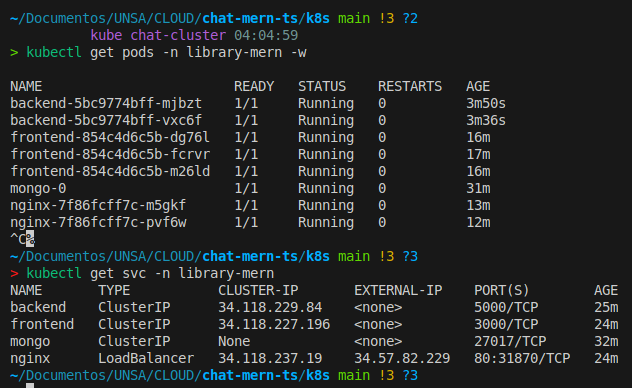
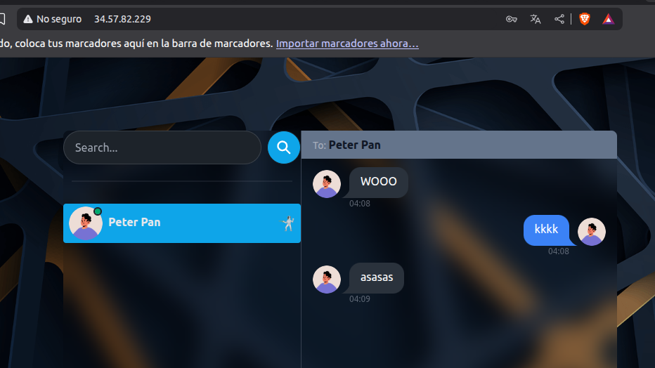
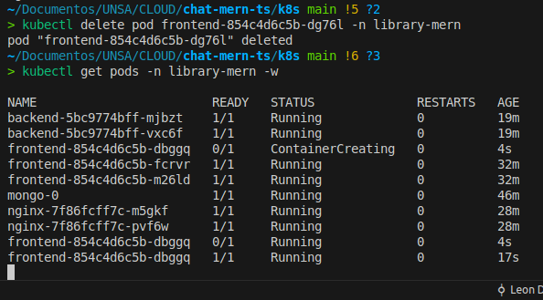
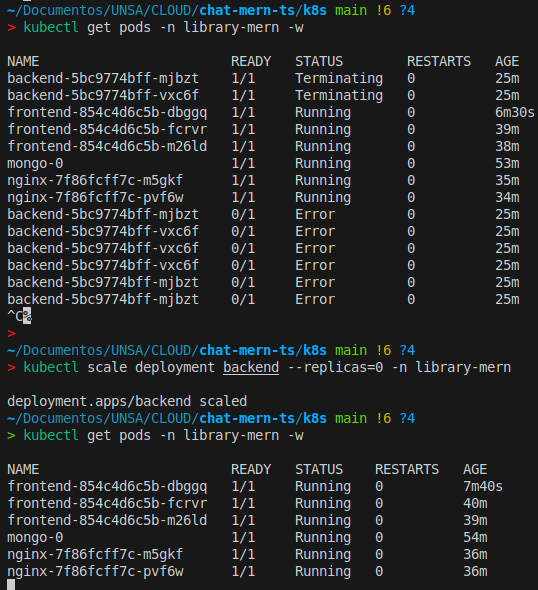
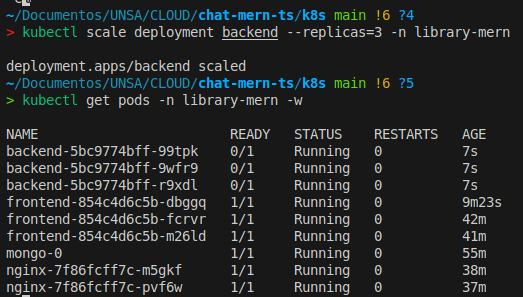

# Aplicación Chat MERN gestionada por Kubernetes

## 1. Título
**Sistema de Chat en Tiempo Real con Arquitectura MERN desplegado en Kubernetes (Google Cloud GKE Autopilot)**

---

## 2. Descripción

Este proyecto implementa una aplicación de chat en tiempo real utilizando la arquitectura **MERN** (MongoDB, Express, React y Node.js), desplegada y orquestada mediante **Kubernetes** en la plataforma **Google Cloud GKE Autopilot**. 

La aplicación permite a múltiples usuarios comunicarse en tiempo real a través de una interfaz web moderna y responsiva. El sistema está diseñado con una arquitectura de microservicios que garantiza alta disponibilidad, escalabilidad automática y tolerancia a fallos.

**Acceso a la aplicación:** http://34.57.82.229/

### Características principales:
- **Alta disponibilidad:** Múltiples réplicas de cada servicio aseguran continuidad operativa
- **Escalabilidad automática:** Kubernetes gestiona automáticamente los recursos según la demanda
- **Persistencia de datos:** MongoDB con almacenamiento persistente garantiza la integridad de los datos
- **Balanceo de carga:** Nginx distribuye el tráfico de manera eficiente entre las réplicas
- **Recuperación automática:** Health checks y probes garantizan reinicio automático ante fallos

---

## 3. Descripción de Microservicios

El sistema está compuesto por cuatro microservicios principales, cada uno diseñado para cumplir funciones específicas y escalarse de manera independiente:

### 3.1 MongoDB (Base de Datos)

**Función:** Almacenamiento persistente de mensajes, usuarios y sesiones del chat.

**Implementación:**
- **Tipo de recurso:** StatefulSet con Headless Service (ClusterIP)
- **Imagen:** `mongo:7.0`
- **Réplicas:** 1 pod
- **Puerto interno:** 27017
- **Credenciales:** Usuario `admin` con contraseña segura almacenada en variables de entorno
- **Almacenamiento:** Volumen persistente de 1Gi mediante PVC (PersistentVolumeClaim)
- **Recursos asignados:** 
  - CPU mínima: 500m
  - Memoria: 2Gi

**Escalabilidad:** 
MongoDB utiliza **StatefulSet** que garantiza identidad persistente y almacenamiento dedicado para cada pod. Aunque actualmente opera con 1 réplica (debido a la capa gratuita), el diseño permite configurar **réplicas con conjunto de réplicas (Replica Set)** para alta disponibilidad y distribución de lecturas. El volumen persistente asegura que los datos no se pierdan incluso si el pod se reinicia o se mueve a otro nodo.

---

### 3.2 Backend (API REST - Node.js/Express)

**Función:** Gestión de la lógica de negocio, autenticación JWT, manejo de sockets para mensajería en tiempo real y comunicación con la base de datos.

**Implementación:**
- **Tipo de recurso:** Deployment + ClusterIP Service
- **Imagen:** `ldavis007/chat-mern-backend:latest`
- **Réplicas:** 3 pods (balanceo de carga automático)
- **Puerto interno:** 5000
- **Configuración sensible:** Secret `backend-env` con variables de entorno (JWT_SECRET, MONGO_DB_URI)
- **Recursos asignados:**
  - CPU: 100m (request) / 200m (limit)
  - Memoria: 128Mi (request y limit)
- **Health Checks:**
  - Liveness Probe: `GET /health` cada 20s (inicio: 15s)
  - Readiness Probe: `GET /health` cada 10s (inicio: 5s)

**Escalabilidad:** 
El backend está diseñado como un servicio **stateless** que puede escalarse horizontalmente sin problemas. Las 3 réplicas actuales distribuyen la carga de trabajo y proporcionan redundancia. Kubernetes puede aumentar o disminuir automáticamente el número de réplicas según métricas de CPU/memoria mediante **Horizontal Pod Autoscaler (HPA)**. El servicio ClusterIP balancea las peticiones entre todas las réplicas disponibles.

**Variables de entorno:**
- `MONGO_DB_URI`: URI de conexión a MongoDB
- `JWT_SECRET`: Clave secreta para tokens de autenticación
- `PORT`: Puerto de escucha (5000)
- `FRONTEND_URL`: URL del frontend para CORS
- `NODE_ENV`: Entorno de ejecución (development)

---

### 3.3 Frontend (Interfaz de Usuario - React)

**Función:** Proporciona la interfaz gráfica para que los usuarios interactúen con el sistema de chat.

**Implementación:**
- **Tipo de recurso:** Deployment + ClusterIP Service
- **Imagen:** `ldavis007/chat-mern-frontend:latest` (imagen optimizada ~20MB)
- **Réplicas:** 3 pods
- **Puerto interno:** 3000
- **Configuración:** ConfigMap `frontend-env` con variables no sensibles
- **Recursos asignados:**
  - CPU: 50m (request) / 100m (limit)
  - Memoria: 64Mi (request) / 128Mi (limit)
- **Health Checks:**
  - Liveness Probe: `GET /` cada 20s (inicio: 15s)
  - Readiness Probe: `GET /` cada 10s (inicio: 5s)

**Escalabilidad:** 
El frontend es completamente **stateless** y puede replicarse infinitamente. Las 3 réplicas garantizan que siempre haya disponibilidad de la interfaz, incluso durante actualizaciones (rolling updates). Al ser una aplicación React compilada y servida estáticamente, consume muy pocos recursos y responde rápidamente a las peticiones. Nginx distribuye las solicitudes entre las réplicas disponibles.

**Variables de configuración:**
- `REACT_APP_API_URL`: URL del backend/Nginx para peticiones API
- `VITE_API_URL`: URL interna del backend

---

### 3.4 Nginx (Proxy Inverso y Balanceador de Carga)

**Función:** Punto de entrada único para la aplicación, enruta el tráfico HTTP hacia frontend y backend, y expone la aplicación al exterior.

**Implementación:**
- **Tipo de recurso:** Deployment + LoadBalancer Service
- **Imagen:** `ldavis007/chat-mern-nginx:latest`
- **Réplicas:** 2 pods
- **Puerto externo:** 80
- **IP externa:** `34.57.82.229` (asignada por Google Cloud)
- **Recursos asignados:**
  - CPU: 50m (request) / 100m (limit)
  - Memoria: 64Mi (request) / 128Mi (limit)
- **Health Checks:**
  - Liveness Probe: `GET /` cada 20s (inicio: 10s)
  - Readiness Probe: `GET /` cada 10s (inicio: 5s)

**Escalabilidad:** 
Nginx actúa como **gateway de entrada** y puede escalarse fácilmente añadiendo más réplicas. El servicio LoadBalancer de Google Cloud distribuye automáticamente el tráfico entrante entre todas las réplicas de Nginx, que a su vez distribuyen las peticiones hacia los servicios internos (frontend y backend). Esta arquitectura permite manejar grandes volúmenes de tráfico sin cuellos de botella.

**Configuración de enrutamiento:**
- `/` → Frontend Service (puerto 3000)
- `/api/*` → Backend Service (puerto 5000)

---

### 3.5 Arquitectura de Comunicación

```
Internet → LoadBalancer (34.57.82.229:80) 
    ↓
Nginx Service (2 réplicas)
    ├─→ Frontend Service (3 réplicas) → Pods Frontend:3000
    └─→ Backend Service (3 réplicas) → Pods Backend:5000
            ↓
        MongoDB Service (1 réplica) → Pod MongoDB:27017
```

Todos los servicios internos utilizan **ClusterIP** para comunicación privada dentro del cluster. Solo Nginx utiliza **LoadBalancer** para exposición externa.

---

## 4. Justificación de Herramientas Utilizadas

### 4.1 Kubernetes (Google Cloud GKE Autopilot)

**¿Por qué Kubernetes?**

Kubernetes es el estándar de facto para orquestación de contenedores y gestión de aplicaciones en microservicios. Para este proyecto, se eligió Kubernetes por las siguientes razones:

1. **Orquestación automática:** Kubernetes gestiona automáticamente el despliegue, escalado y operación de los contenedores, eliminando tareas manuales repetitivas.

2. **Alta disponibilidad:** Mediante el uso de réplicas múltiples y health checks (liveness/readiness probes), Kubernetes garantiza que la aplicación esté siempre disponible. Si un pod falla, Kubernetes lo reinicia o reemplaza automáticamente.

3. **Escalabilidad horizontal:** Permite escalar servicios añadiendo o quitando réplicas según la demanda, tanto manual como automáticamente (HPA - Horizontal Pod Autoscaler).

4. **Despliegues sin tiempo de inactividad:** Las estrategias de rolling updates permiten actualizar la aplicación sin interrumpir el servicio.

5. **Gestión declarativa:** Los archivos YAML definen el estado deseado del sistema, y Kubernetes se encarga de mantenerlo, facilitando versionado y reproducibilidad.

6. **Service discovery y balanceo de carga:** Kubernetes proporciona DNS interno y balanceo de carga automático entre réplicas mediante Services.

**¿Por qué GKE Autopilot?**

GKE Autopilot es la opción gestionada de Kubernetes en Google Cloud que ofrece ventajas adicionales:

- **Gestión automática de nodos:** Google Cloud administra completamente la infraestructura subyacente, optimizando recursos y costos.
- **Seguridad mejorada:** Actualizaciones automáticas de seguridad y configuraciones hardened por defecto.
- **Facturación por pod:** Solo se paga por los recursos que los pods realmente consumen, no por nodos completos.
- **Menos operaciones:** No requiere gestión manual de node pools, versiones o escalado de nodos.

**Evidencia en el proyecto:**
- Recreación automática de pods eliminados (simulación de fallos)
- Escalado de 0 a 3 réplicas sin intervención manual compleja
- Distribución automática de carga entre réplicas

---

### 4.2 Docker y Docker Hub

**¿Por qué Docker?**

Docker es la tecnología de contenedores más utilizada y es fundamental para Kubernetes. Se eligió Docker por:

1. **Portabilidad:** Los contenedores empaquetan la aplicación con todas sus dependencias, garantizando que funcione igual en cualquier entorno (desarrollo, testing, producción).

2. **Aislamiento:** Cada microservicio corre en su propio contenedor con sus propias dependencias, evitando conflictos.

3. **Eficiencia:** Los contenedores son más ligeros que máquinas virtuales, permitiendo mayor densidad de aplicaciones por servidor.

4. **Versionado de imágenes:** Docker Hub permite mantener diferentes versiones de las imágenes (tags) facilitando rollbacks y control de versiones.

5. **Build reproducibles:** Los Dockerfiles garantizan que las imágenes se construyan de manera consistente.

**Docker Hub como Registry:**

Docker Hub se utiliza como registro público para almacenar y distribuir las imágenes:

- **Accesibilidad global:** Kubernetes puede descargar las imágenes desde cualquier región de Google Cloud
- **CI/CD integration:** Facilita pipelines de integración y despliegue continuo
- **Versionado:** Permite tags como `latest`, `v1.0`, etc., para gestión de versiones

**Imágenes utilizadas:**
- `ldavis007/chat-mern-backend:latest` (Backend Node.js/Express)
- `ldavis007/chat-mern-frontend:latest` (Frontend React optimizado)
- `ldavis007/chat-mern-nginx:latest` (Nginx configurado como proxy)
- `mongo:7.0` (MongoDB oficial)

---

### 4.3 Nginx como Proxy Inverso

**¿Por qué Nginx?**

1. **Alto rendimiento:** Nginx es conocido por su eficiencia manejando miles de conexiones simultáneas con bajo consumo de recursos.

2. **Proxy inverso y balanceador:** Permite centralizar el punto de entrada y distribuir tráfico hacia múltiples servicios internos (frontend/backend).

3. **Gestión de rutas:** Facilita el enrutamiento basado en paths (`/` → frontend, `/api/*` → backend) desde un único dominio/IP.

4. **Compresión y caché:** Puede comprimir respuestas y cachear contenido estático, mejorando tiempos de respuesta.

5. **Punto único de entrada:** Simplifica la configuración de DNS y certificados SSL (en producción).

**Alternativas consideradas:**
- **Ingress Controller:** Aunque Kubernetes ofrece Ingress, para este proyecto se optó por Nginx explícito para mayor control y simplicidad en el despliegue inicial.

---

### 4.4 MongoDB con StatefulSet

**¿Por qué StatefulSet en lugar de Deployment?**

MongoDB requiere **almacenamiento persistente y identidad estable**, características que StatefulSet proporciona:

1. **Identidad persistente:** Cada pod tiene un nombre predecible (`mongo-0`, `mongo-1`, etc.) que se mantiene entre reinicios.

2. **Volúmenes persistentes dedicados:** Cada pod obtiene su propio PVC (PersistentVolumeClaim) que persiste aunque el pod se elimine.

3. **Orden de despliegue:** StatefulSet garantiza orden en la creación/eliminación de pods, crucial para bases de datos.

4. **Preparado para réplicas:** Aunque actualmente usa 1 réplica, el diseño con StatefulSet facilita expandir a un Replica Set de MongoDB en el futuro.

**Alternativa descartada:**
- **Deployment:** No garantiza persistencia ni identidad, inadecuado para bases de datos.

---

## 5. Otros Datos Relevantes

### 5.1 Namespace Dedicado

Todos los recursos se despliegan en el namespace `library-mern`, lo que proporciona:
- **Aislamiento lógico:** Separación de recursos de otras aplicaciones
- **Gestión simplificada:** Facilita operaciones como `kubectl get all -n library-mern`
- **Control de acceso:** Permite políticas RBAC específicas por namespace

### 5.2 Configuración de Recursos

Se definieron **requests y limits de CPU/memoria** para cada servicio:

**Backend:**
- Requests: 100m CPU, 128Mi RAM
- Limits: 200m CPU, 128Mi RAM

**Frontend:**
- Requests: 50m CPU, 64Mi RAM
- Limits: 100m CPU, 128Mi RAM

**Nginx:**
- Requests: 50m CPU, 64Mi RAM
- Limits: 100m CPU, 128Mi RAM

Esto garantiza:
- **Scheduling eficiente:** Kubernetes sabe qué recursos necesita cada pod
- **Prevención de consumo excesivo:** Los limits evitan que un servicio monopolice recursos
- **Mejor rendimiento en Autopilot:** GKE Autopilot optimiza costos basándose en estos valores

### 5.3 Health Checks y Auto-recuperación

Todos los servicios implementan **Liveness y Readiness Probes**:

**Liveness Probe:** Verifica si el servicio está "vivo". Si falla, Kubernetes reinicia el pod.
**Readiness Probe:** Verifica si el servicio está listo para recibir tráfico. Si falla, Kubernetes lo saca del balanceo temporalmente.

Esto garantiza:
- Reinicio automático ante bloqueos
- Tráfico dirigido solo a pods saludables
- Despliegues sin downtime (rolling updates)

### 5.4 Gestión de Configuración

**Secrets para datos sensibles:**
- `backend-secret`: Almacena JWT_SECRET, MONGO_DB_URI (credenciales codificadas en base64)

**ConfigMaps para configuración no sensible:**
- `frontend-configmap`: URLs públicas del API

Esto separa configuración de código y facilita cambios sin reconstruir imágenes.

### 5.5 Estructura de Archivos Kubernetes

```
k8s/
├── namespace.yaml
├── backend/
│   ├── backend-deployment.yaml
│   ├── backend-service.yaml
│   └── backend-secret.yaml
├── frontend/
│   ├── frontend-deployment.yaml
│   ├── frontend-service.yaml
│   └── frontend-configmap.yaml
├── mongo/
│   ├── mongo-statefulset.yaml
│   └── mongo-service.yaml
└── nginx/
    ├── nginx-deployment.yaml
    └── nginx-service.yaml
```

### 5.6 Proceso de Despliegue

```bash
# 1. Crear namespace
kubectl apply -f k8s/namespace.yaml

# 2. Desplegar MongoDB (base de datos primero)
kubectl apply -f k8s/mongo/

# 3. Desplegar Backend (espera a MongoDB)
kubectl apply -f k8s/backend/

# 4. Desplegar Frontend
kubectl apply -f k8s/frontend/

# 5. Desplegar Nginx (punto de entrada)
kubectl apply -f k8s/nginx/

# 6. Verificar estado
kubectl get all -n library-mern
```

### 5.7 Comandos de Gestión Útiles

**Ver estado de todos los recursos:**
```bash
kubectl get all -n library-mern
```

**Reiniciar un deployment (forzar descarga de imagen):**
```bash
kubectl rollout restart deployment backend -n library-mern
kubectl rollout restart deployment frontend -n library-mern
kubectl rollout restart deployment nginx -n library-mern
```

**Escalar réplicas manualmente:**
```bash
kubectl scale deployment backend --replicas=5 -n library-mern
```

**Ver logs de un servicio:**
```bash
kubectl logs -f deployment/backend -n library-mern
```

**Acceder a un pod:**
```bash
kubectl exec -it <pod-name> -n library-mern -- /bin/bash
```

### 5.8 Tolerancia a Fallos Demostrada

Se realizaron pruebas de resiliencia:

**1. Eliminación manual de pod:**
- Se eliminó un pod de backend
- Kubernetes detectó la diferencia entre estado actual (2 réplicas) y deseado (3 réplicas)
- Automáticamente creó un nuevo pod en segundos
- **Resultado:** Servicio sin interrupciones

**2. Escalado a 0 réplicas:**
- Se escaló backend a 0 réplicas
- Todos los pods fueron terminados
- Se escaló de regreso a 3 réplicas
- Kubernetes recreó los 3 pods automáticamente
- **Resultado:** Recuperación total sin intervención manual

**3. Health check failures:**
- Si un pod falla sus health checks, Kubernetes lo reinicia automáticamente
- Durante el reinicio, el tráfico se redirige a los pods saludables
- **Resultado:** Alta disponibilidad mantenida

### 5.9 Arquitectura Visual

La aplicación sigue este flujo de datos:

```
Usuario → Internet
    ↓
Load Balancer (IP: 34.57.82.229)
    ↓
Nginx Pods (2 réplicas)
    ├─→ Frontend Pods (3 réplicas)
    └─→ Backend Pods (3 réplicas)
            ↓
        MongoDB Pod (StatefulSet)
            ↓
        Persistent Volume (1Gi)
```

### 5.10 Requisitos Técnicos

**Software necesario:**
- Ubuntu 22.04 o superior
- Docker (para construcción de imágenes)
- Google Cloud SDK (`gcloud` CLI)
- kubectl (cliente de Kubernetes)
- Cuenta de Docker Hub
- Proyecto de Google Cloud con facturación habilitada

**Configuración inicial de GCloud:**
```bash
gcloud auth login
gcloud config set project vivid-primacy-474007-e9
gcloud config set compute/region us-central1
```

**Creación del cluster:**
```bash
gcloud container clusters create-auto chat-cluster --region us-central1
```

**Obtener credenciales:**
```bash
gcloud container clusters get-credentials chat-cluster --region us-central1
```

---

## 6. Resultados y Evidencias

### 6.1 Arquitectura General Desplegada

El sistema completo está operativo con:
- **MongoDB:** 1 pod con almacenamiento persistente
- **Backend:** 3 réplicas balanceando carga
- **Frontend:** 3 réplicas sirviendo la interfaz
- **Nginx:** 2 réplicas como gateway de entrada



Todos los servicios internos se comunican mediante ClusterIP, mientras que Nginx expone la aplicación mediante LoadBalancer con IP pública `34.57.82.229`.

### 6.2 Acceso a la Aplicación

La aplicación está disponible públicamente en: **http://34.57.82.229/**



Solo Nginx tiene IP externa; los demás servicios (Backend, Frontend, MongoDB) tienen IPs internas ClusterIP y no son accesibles directamente desde Internet, garantizando seguridad.

### 6.3 Pruebas de Resiliencia

**Simulación 1: Eliminación de Pod**
- Al eliminar un pod de backend manualmente, Kubernetes lo detecta y crea un nuevo pod automáticamente
- El Deployment mantiene siempre las 3 réplicas deseadas
- **Tiempo de recuperación:** < 10 segundos



**Simulación 2: Escalado a 0 y Recuperación**
- Escalado a 0 réplicas: Todos los pods se eliminan ordenadamente


- Escalado a 3 réplicas: Kubernetes recrea los 3 pods automáticamente



- **Tiempo de recuperación completa:** < 30 segundos
- Demuestra la capacidad de Kubernetes para mantener el estado deseado


## 7. Conclusiones

Este proyecto demuestra una implementación exitosa de una aplicación de chat en tiempo real utilizando arquitectura de microservicios orquestada por Kubernetes. Los puntos clave son:

1. **Escalabilidad probada:** Cada servicio puede escalar independientemente según demanda
2. **Alta disponibilidad:** Múltiples réplicas y health checks garantizan servicio continuo
3. **Recuperación automática:** Kubernetes gestiona fallos sin intervención manual
4. **Arquitectura moderna:** Separación de responsabilidades en microservicios independientes
5. **Gestión eficiente:** Autopilot optimiza recursos y reduce overhead operacional

El uso de Kubernetes, Docker, Nginx y MongoDB como StatefulSet representa una solución robusta, escalable y lista para producción que puede manejar crecimiento de usuarios y recuperarse automáticamente de fallos.